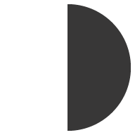

#  Stream io Dashboard Assignment

As an [assignment](https://gist.github.com/jaapbakker88/c1f3aea505801c5a5bf7b5acff459721) for an interview for Stream io, I was asked to create a dashboard, based on [this dribble](https://dribbble.com/shots/13940752-Dashboard-UI).

## Design details:

I tried to mimic the dashboard design as much as possible, but some things are missing:

* The `border-radius` from the search input does not match with the guideline, since I used a pre-made component for that.
* Graphs are placeholder images instead of *actual graphs*
* The `IconButton`s from the cards do not have the `background-color` set since they were inconsistent.
* The Banner's `border-radius` is the same in all borders (preview image has `bottom-right` without radius)
* The avatar image does not have the `drop-down` arrow since its not implemented
* The dashboard [font](https://www.fonts.com/font/linotype/neue-helvetica) was replaced since I didn't have it available  

## Technical details:

This project was bootstrapped with [Create React App](https://github.com/facebook/create-react-app), on top of which I added some [dependencies](#dependencies).

## To run the app

In the project directory, you have to first run 
`yarn install`. Available scripts:

### `yarn start`

Runs the app in the development mode. 
Open [http://localhost:3000](http://localhost:3000) to view it in the browser.

The page will reload if you make edits. 
You will also see any lint errors in the console.

### `yarn build`

Builds the app for production to the `build` folder. 
It correctly bundles React in production mode and optimizes the build for the best performance.

The build is minified and the filenames include the hashes. 
Your app is ready to be deployed!

## Dependencies

Since I didn't have enough time to build the app, I used some already-made components to speed up the development process.

* [RMWC](https://rmwc.io/) for the `Input`, `Icon` and `IconButton` components.
* [react-router](https://reactrouter.com/) as the routing component.
* The font icon library is from [Material icons](https://material.io/resources/icons).
* Custom icons are from [flaticon](htt.ps://www.flaticon.com/).

## Missing

1. Testing: CRA provides Jest as testing framework. I kept the original files but didn't add any tests.
2. Responsiveness: Even though the dashboard resizes according screen size, the `drawer` is always open. I would have added a `hamburger` button to open/close it when using smaller screens.
3. Functionality: I added a container page for each of the `drawer`'s links, but they are all blank (only an *under construction* sign is shown).
5. Design system (I would have it complemented with [storybooks](https://storybook.js.org/) components)
6. Animations (There is only a Ripple effect on the `IconButtons`)